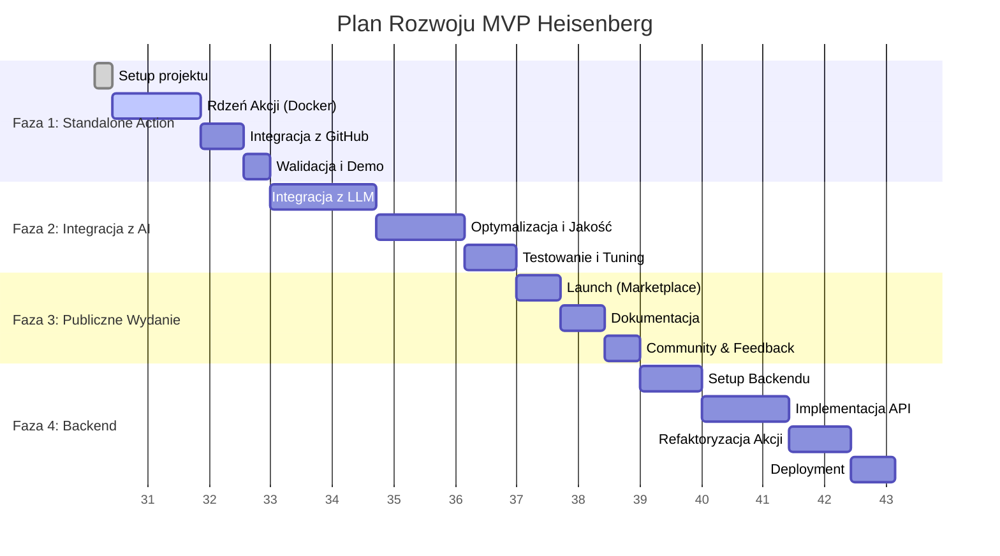

# The Heisenberg: Plan Implementacji MVP

## 1. Przegląd Faz

Plan rozwoju MVP jest podzielony na cztery iteracyjne fazy, zaprojektowane z myślą o szybkim dostarczeniu wartości i zebraniu feedbacku. Całkowity szacowany czas pracy wynosi 14 tygodni, przy założeniu zaangażowania 20 godzin tygodniowo.

| Faza | Nazwa | Czas trwania | Główny cel |
| :--- | :---- | :----------- | :--------- |
| **Faza 1** | Standalone GitHub Action (Proof of Concept) | 3 tygodnie | Działająca akcja, która zbiera artefakty i logi, publikując podstawowy, ustrukturyzowany raport w PR. |
| **Faza 2** | Integracja z AI (Core Value) | 4 tygodnie | Wzbogacenie raportu o automatyczną diagnozę przyczyny błędu wygenerowaną przez LLM (Claude 3.5 Sonnet). |
| **Faza 3** | Publiczne Wydanie i Pętla Feedbacku | 2 tygodnie | Publikacja w GitHub Marketplace, stworzenie dokumentacji i aktywne zbieranie opinii od pierwszych użytkowników. |
| **Faza 4** | Backend i Persystencja Danych | 5 tygodni | Stworzenie API (FastAPI), bazy danych (PostgreSQL) i przeniesienie logiki analizy na stronę serwera. |

---

## 2. Architektura Docelowa (po Fazie 4)

Diagram przedstawia przepływ danych i interakcje między komponentami w docelowej architekturze MVP.

```mermaid
graph TD
    subgraph "Użytkownik CI/CD (GitHub Actions)"
        A[Workflow startuje] --> B{Testy Playwright};
        B -- Failed --> C[Uruchomienie "heisenberg-analyze"];
        C --> D[1. Zbierz dane: Playwright Report, trace.zip, Docker logs];
    end

    subgraph "Heisenberg Action"
        D --> E[2. Wyślij dane do Heisenberg API];
        E --> F[5. Odbierz diagnozę];
        F --> G[6. Opublikuj komentarz w PR];
    end

    subgraph "Heisenberg Backend (FastAPI on PaaS)"
        E -- POST /analyze --> H[API Endpoint];
        H --> I{Auth & Walidacja};
        I --> J[3. Zapisz dane w PostgreSQL + pgvector];
        J --> K[4. Wywołaj Claude/GPT API z promptem];
        K --> L[Przetwórz odpowiedź LLM];
        L --> J;
        L --> F;
    end

    subgraph "Zewnętrzne Serwisy"
        K <--> M[Claude / OpenAI API];
    end

    subgraph "GitHub"
        G <--> P[GitHub API];
    end

    style C fill:#228B22,stroke:#fff,stroke-width:2px,color:#fff
    style H fill:#87CEEB,stroke:#333,stroke-width:2px,color:#000
```

---

## 3. Szczegółowe Zadania

### Faza 1: Standalone GitHub Action (Proof of Concept) - 3 tygodnie

**Cel:** Stworzenie funkcjonalnego prototypu, który dowodzi możliwości zbierania niezbędnych danych w środowisku GitHub Actions.

- [ ] **Setup projektu**
    - [ ] Zainicjowanie repozytorium z `pre-commit`, `ruff`, `black`, `pytest`.
    - [ ] Skonfigurowanie CI dla samego projektu akcji (testowanie i publikacja).
- [ ] **Rdzeń Akcji (Docker/Python)**
    - [ ] Stworzenie pliku `action.yml` z podstawowymi wejściami (np. ścieżka do raportu, nazwy serwisów Docker).
    - [ ] Implementacja logiki do parsowania raportu JSON z Playwright w celu identyfikacji nieudanych testów.
    - [ ] Implementacja logiki do odnajdywania i archiwizowania artefaktów `trace.zip`.
    - [ ] Implementacja logiki do pobierania logów `stdout`/`stderr` z określonych kontenerów Docker (`docker logs`).
- [ ] **Integracja z GitHub**
    - [ ] Dodanie logiki do publikowania sformatowanego komentarza w Pull Requeście powiązanym z commitem.
    - [ ] Stworzenie szablonu komentarza w Markdown, zawierającego: nazwę testu, błąd, link do artefaktu, fragmenty logów z okresu awarii.
- [ ] **Walidacja**
    - [ ] Stworzenie oddzielnego repozytorium demonstracyjnego z typowym projektem Playwright do testowania akcji.
    - [ ] Napisanie podstawowej dokumentacji `README.md` wyjaśniającej użycie.

### Faza 2: Integracja z AI (Core Value) - 4 tygodnie

**Cel:** Przekształcenie surowego raportu w inteligentną diagnozę, która dostarcza realną wartość użytkownikowi.

- [ ] **Integracja z LLM**
    - [ ] Zabezpieczenie klucza API do LLM przy użyciu GitHub Secrets.
    - [ ] Stworzenie modułu do prompt engineeringu, który kompiluje dane z testu i logów w spójny kontekst dla modelu.
    - [ ] Implementacja klienta API do komunikacji z Claude 3.5 Sonnet (lub GPT-4o).
    - [ ] Zintegrowanie odpowiedzi z LLM z szablonem komentarza w PR.
- [ ] **Optymalizacja i Jakość**
    - [ ] Implementacja logiki do kompresji i filtrowania logów w celu optymalizacji kosztów i limitów tokenów.
    - [ ] Dodanie "Confidence Score" do odpowiedzi AI (np. poprzez prośbę w prompcie).
    - [ ] Udoskonalenie formatowania komentarza, aby wyraźnie oddzielić dane wejściowe od analizy AI.
    - [ ] Implementacja obsługi błędów dla wywołań API (timeouty, rate limiting, błędy 5xx).
- [ ] **Testowanie**
    - [ ] Przetestowanie na co najmniej 10 różnych scenariuszach flaky testów, aby dostroić prompt.

### Faza 3: Publiczne Wydanie i Pętla Feedbacku - 2 tygodnie

**Cel:** Udostępnienie produktu szerszej publiczności i ustanowienie kanałów do zbierania opinii.

- [ ] **Launch**
    - [ ] Sfinalizowanie i opublikowanie akcji w GitHub Marketplace.
    - [ ] Stworzenie prostej strony docelowej (landing page) na GitHub Pages.
- [ ] **Dokumentacja**
    - [ ] Rozbudowanie `README.md` o szczegółowe instrukcje, przykłady użycia i opis wszystkich opcji.
    - [ ] Stworzenie przewodnika "Quick Start" pokazującego integrację w mniej niż 5 minut.
    - [ ] Dodanie pliku `CONTRIBUTING.md` dla potencjalnych kontrybutorów.
- [ ] **Community**
    - [ ] Przygotowanie i publikacja ogłoszeń o starcie (np. na Hacker News, Reddit r/programming, Dev.to).
    - [ ] Stworzenie oficjalnego kanału do zbierania feedbacku (np. GitHub Issues z szablonami, serwer Discord).
    - [ ] Aktywne monitorowanie pierwszych instalacji i szybkie reagowanie na zgłaszane problemy.

### Faza 4: Backend i Persystencja Danych - 5 tygodni

**Cel:** Zbudowanie fundamentów pod skalowalny produkt SaaS i przyszłe funkcje (np. historia analiz, wykrywanie wzorców).

- [ ] **Setup Backendu**
    - [ ] Zainicjowanie projektu FastAPI z Pydantic, SQLAlchemy i Alembic.
    - [ ] Zaprojektowanie i implementacja schematu bazy danych w PostgreSQL (tabele dla użytkowników/organizacji, przebiegów testów, analiz).
    - [ ] Konfiguracja `pgvector` do przyszłego wykorzystania.
- [ ] **API**
    - [ ] Implementacja endpointu `/api/v1/analyze` do przyjmowania danych z GitHub Action.
    - [ ] Implementacja mechanizmu uwierzytelniania dla akcji (np. klucze API per instalacja).
- [ ] **Refaktoryzacja**
    - [ ] Przeniesienie logiki wywołań LLM z GitHub Action na stronę backendu.
    - [ ] Zmodyfikowanie GitHub Action, aby wysyłała dane do backendu i odbierała gotową diagnozę.
    - [ ] Implementacja zapisu każdej analizy w bazie danych.
- [ ] **Deployment**
    - [ ] Stworzenie konfiguracji `docker-compose.yml` do lokalnego uruchamiania całego stacku.
    - [ ] Wdrożenie backendu i bazy danych na platformie PaaS (np. Render, Railway) z konfiguracją CI/CD.

---

## 4. Zależności Między Zadaniami



---

## 5. Kamienie Milowe i Definition of Done

| Faza | Kamień Milowy | Definition of Done (DoD) |
| :--- | :--- | :--- |
| **1** | **Wewnętrzne PoC** | Akcja uruchamia się w repozytorium demo, poprawnie zbiera raport Playwright, `trace.zip` oraz logi Docker, a następnie publikuje w PR ustrukturyzowany komentarz (bez udziału AI). |
| **2** | **Inteligentna Diagnoza** | Komentarz w PR zawiera trafną i użyteczną diagnozę problemu wygenerowaną przez AI, wraz z "Confidence Score". Prompt został przetestowany na wielu scenariuszach. |
| **3** | **Publiczny Start** | Akcja jest dostępna w GitHub Marketplace, posiada kompletną dokumentację, a pierwsi użytkownicy (min. 10) z powodzeniem ją zainstalowali. Działa kanał do zbierania feedbacku. |
| **4** | **Skalowalna Platforma** | Analizy są przeprowadzane przez backend i trwale zapisywane w bazie danych. Akcja jest tylko klientem API. Całość jest wdrożona i działa stabilnie w chmurze (PaaS). |

---

## 6. Ryzyka Techniczne i Mitigacje

### Faza 1

| Ryzyko | Mitygacja |
|--------|-----------|
| Problemy z dostępem do logów Docker z wewnątrz kontenera akcji w środowisku GitHub Actions. | Wykorzystanie montowania gniazda Docker (`docker.sock`) z dokładnym udokumentowaniem implikacji bezpieczeństwa. Alternatywnie, użycie `docker/build-push-action` do budowania obrazu z dostępem do logów. |
| Duża różnorodność konfiguracji projektów użytkowników (ścieżki do raportów, niestandardowe nazwy serwisów). | Stworzenie elastycznych, ale prostych opcji konfiguracyjnych w `action.yml`. Dostarczenie jasnych komunikatów o błędach w przypadku braku znalezienia zasobów. |

### Faza 2

| Ryzyko | Mitygacja |
|--------|-----------|
| Niska jakość diagnoz generowanych przez AI (halucynacje, zbyt ogólne porady). | Intensywna praca nad prompt engineeringiem (techniki few-shot, chain-of-thought). Zawsze dołączaj "surowe" dane (logi) obok analizy. Wyraźnie oznaczaj diagnozę jako wygenerowaną przez AI z podaniem "Confidence Score". |
| Wysokie koszty i opóźnienia związane z API LLM. | Użycie zbalansowanego modelu (Claude 3.5 Sonnet / GPT-4o). Agresywna kompresja i filtrowanie kontekstu przed wysłaniem go do modelu. W przyszłości (po Fazie 4) - cachowanie odpowiedzi dla podobnych błędów. |

### Faza 3

| Ryzyko | Mitygacja |
|--------|-----------|
| Negatywny odbiór produktu z powodu trudności w konfiguracji lub słabych wyników. | Stworzenie doskonałego przewodnika "Quick Start", w tym wideo. Priorytetowe traktowanie i szybkie reagowanie na zgłoszenia błędów od pierwszych użytkowników. |
| Niska adopcja po publicznym starcie. | Przygotowanie materiałów promocyjnych z wyprzedzeniem. Aktywna promocja w docelowych społecznościach (np. Discord Playwright, fora o testowaniu, Twitter/X). |

### Faza 4

| Ryzyko | Mitygacja |
|--------|-----------|
| Luki bezpieczeństwa w publicznie dostępnym API. | Zastosowanie solidnego uwierzytelniania (np. tokeny JWT generowane podczas instalacji aplikacji GitHub). Walidacja wszystkich danych wejściowych za pomocą Pydantic. Regularne audyty bezpieczeństwa. |
| Złożoność operacyjna (DevOps) związana z utrzymaniem stacku backendowego. | Wykorzystanie zarządzanej platformy PaaS (np. Render) do minimalizacji pracy DevOps. Stosowanie Infrastructure as Code (Docker Compose) od samego początku. |

---

## 7. Stack Technologiczny na Fazę

| Faza | Komponent | Technologia |
| :--- | :--- | :--- |
| **1** | GitHub Action | Docker, Python 3.11, `requests`, `PyYAML` |
| | Tooling | `black`, `ruff`, `pytest` |
| **2** | AI | Claude 3.5 Sonnet API, `anthropic` (Python SDK) |
| **3** | Strona WWW | GitHub Pages, Jekyll / Hugo |
| | Community | GitHub Issues, Discord |
| **4** | Backend | FastAPI, Uvicorn, Pydantic |
| | Baza Danych | PostgreSQL 16, pgvector, SQLAlchemy, Alembic |
| | Deployment | Docker, Docker Compose, Render / Railway (PaaS) |
