# Heisenberg Architecture

## System Overview

## Observation Points Detail

```mermaid
flowchart LR
    subgraph Frontend["Frontend Observations"]
        direction TB
        T1["🎭 Playwright Traces"]
        T1a["├─ Console: JS errors/warnings"]
        T1b["├─ Network: Failed API calls"]
        T1c["├─ Actions: Click/navigation timeline"]
        T1d["└─ DOM: Snapshots at failure"]

        T2["📸 Screenshots"]
        T2a["└─ Visual state at failure moment"]
    end

    subgraph Backend["Backend Observations"]
        direction TB
        T3["📋 Job Logs"]
        T3a["├─ CI/CD errors"]
        T3b["├─ Test runner output"]
        T3c["└─ Build failures"]

        T4["🐳 Container Logs"]
        T4a["├─ API server errors"]
        T4b["├─ Database errors"]
        T4c["└─ Service timeouts"]
    end

    subgraph TestData["Test Data"]
        direction TB
        T5["📊 Test Reports"]
        T5a["├─ Failed test names"]
        T5b["├─ Error messages"]
        T5c["├─ Stack traces"]
        T5d["└─ Test duration"]
    end

    Frontend --> AI["🤖 AI Correlation"]
    Backend --> AI
    TestData --> AI
    AI --> D["📝 Root Cause Diagnosis"]
```

## Data Flow Timeline

## Component Responsibilities

| Component | File | Responsibility |
|-----------|------|----------------|
| **CLI** | `cli/commands.py` | Entry point, orchestration |
| **GitHub Artifacts** | `github_artifacts.py` | Download & extract artifacts |
| **Playwright Parser** | `playwright_parser.py` | Parse JSON reports |
| **JUnit Parser** | `junit_parser.py` | Parse XML reports |
| **Trace Analyzer** | `trace_analyzer.py` | Extract console/network/actions |
| **Screenshot Analyzer** | `screenshot_analyzer.py` | Vision LLM analysis |
| **Job Logs Processor** | `job_logs_processor.py` | Filter relevant CI logs |
| **Log Compressor** | `log_compressor.py` | Smart log filtering |
| **Unified Model** | `unified_model.py` | Framework-agnostic representation |
| **Prompt Builder** | `prompt_builder.py` | Construct LLM prompts |
| **LLM Client** | `llm_client.py` | Claude/OpenAI/Gemini calls |
| **Diagnosis Parser** | `diagnosis.py` | Parse LLM response |
| **AI Analyzer** | `ai_analyzer.py` | Orchestrate AI analysis |

## Observation Points Summary

| Source | Data Type | Purpose |
|--------|-----------|---------|
| **Playwright Traces** | Console logs | JS errors, React warnings |
| | Network requests | Failed API calls, timeouts |
| | Action timeline | User interaction sequence |
| **Screenshots** | Images | Visual state at failure |
| **Job Logs** | Text | CI/CD errors, test output |
| **Container Logs** | Text | Backend errors, DB issues |
| **Test Reports** | JSON/XML | Error messages, stack traces |
